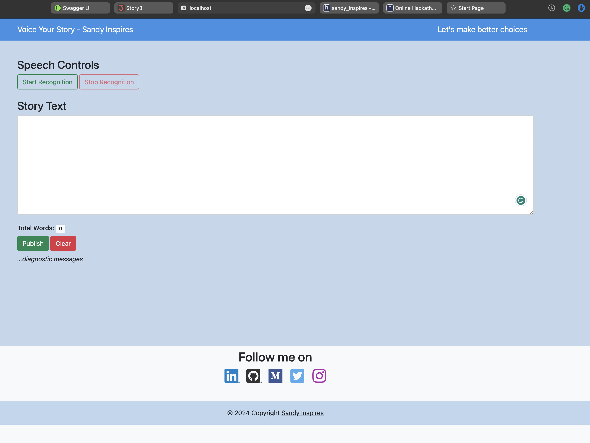
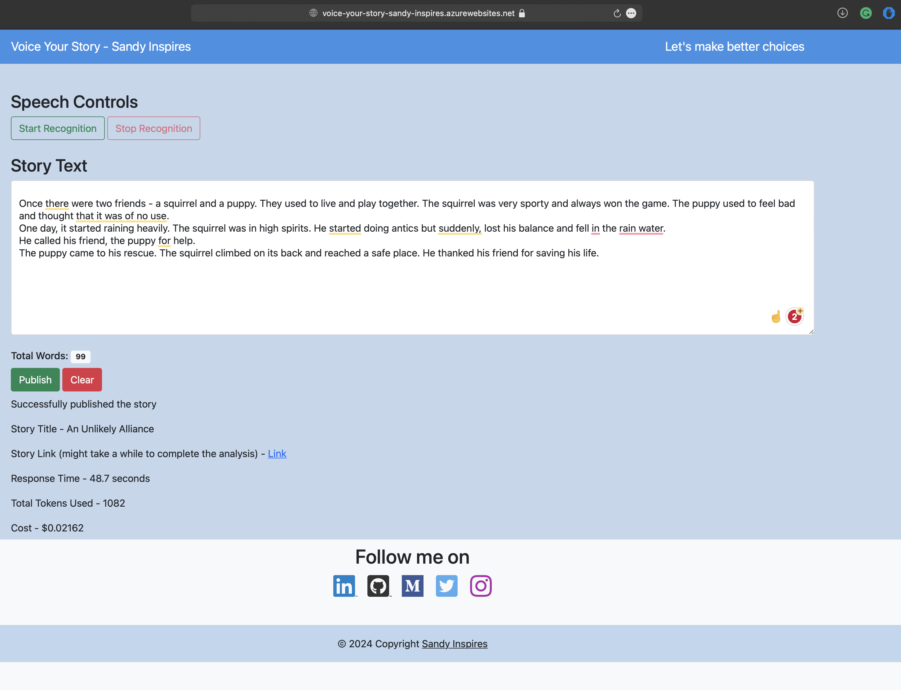

# Voice Your Story

## Inspiration

Have you ever wondered what would have happened if you could change your choice on the client presentation today? or while closing a client deal? or just taking the road to your office? Story3 can help you reveal just that with a hint of help from LLMs. If you've made choices in your life and want to see what are all the other choices you had and what good or bad could have happened if you made them. It's super exciting to see what would've happened.

## Tech Stack

- **Story3 APIs** - to create, update, and publish stories and twists

- **Azure OpenAI Service** - Make Chat Completion API calls

- **Azure Functions** - Hosting the web application

- **Python** - for all the backend coding for story generation

## What is can do

- Help you understand what could be the outcome of your action

- Help you to make better decisions in life

- Make you realize how a better action could have been made

- Take you through a journey of twists within your decision choices

### [Click here start voicing your story!!!🗣️](https://voice-your-story-sandy-inspires.azurewebsites.net/api/speak_out?code=6f0UgR95lyiL8NDGt6Dyx6JnnoZ32a7Jlq3RVSdxyHzDAzFu8zugeA==&name=index.html)

## Screenshots 
### UI

### After Story Generation

## Disclaimer

This is not a tool that you can trust completely and never rely on the outcomes generated by LLMs. It can be wrong, unpredictable or unexplainable so always make sure to use your better judgement with commonsense before acting on the results produced. Consult a certified trained or a doctor to get help on your needs.
